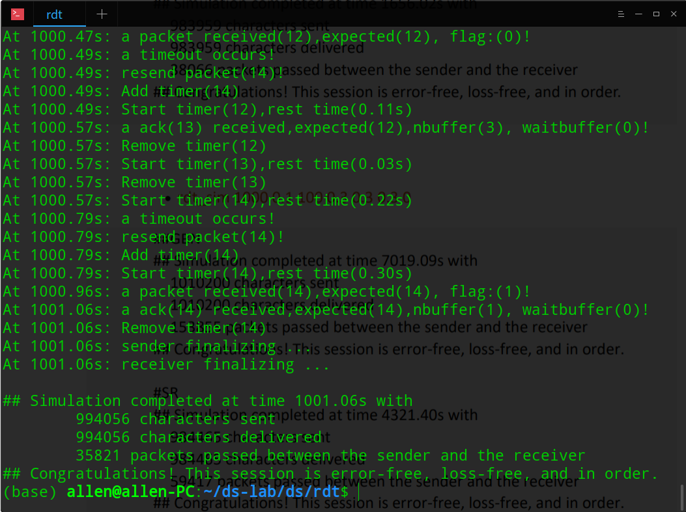
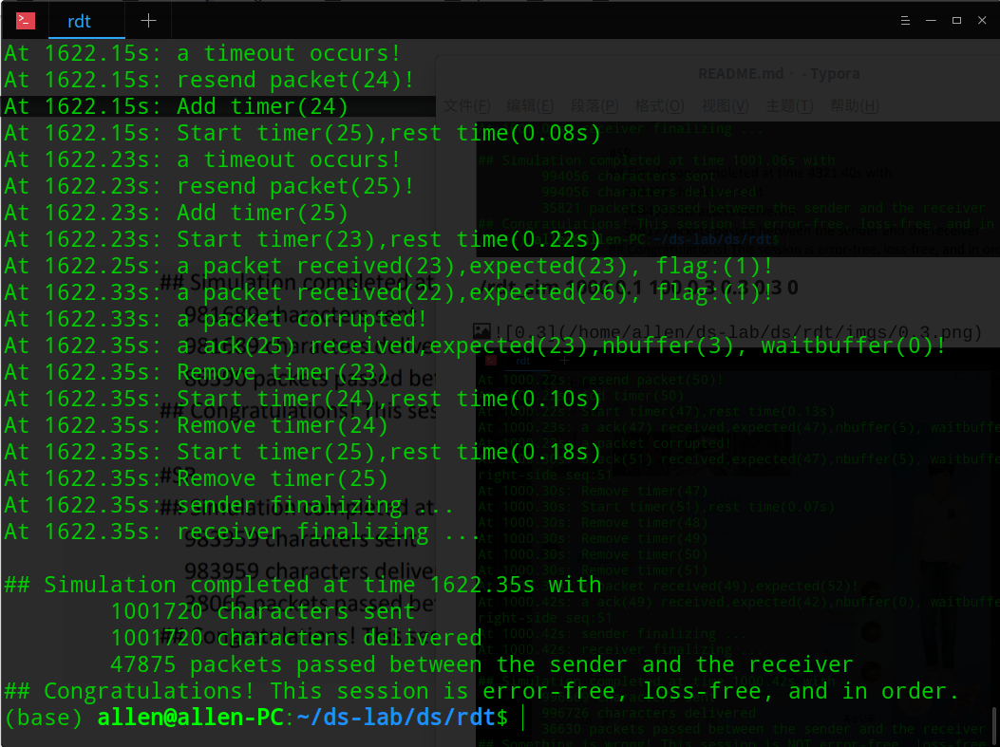

## Lab1 The design of RDT( an error-free, loss-free and in-order delivery protocol )

My student ID : 516030910293

Name: Yao Zihang (姚子航) 

E-mail address : esdeath@sjtu.edu.cn

### My design

+ My protocol combine GBN with select N, with WINDOW_SIZE = 10, maximum sequence number = 127, TIME_OUT = 0.3.

+ In this protocol, the packet format is laid out as the following: 

 

     |<-   2 byte   ->|<-   1 byte   ->|<-      1 bit       ->|<-                7 bit               ->|<-              the rest            ->|

     |   checksum   | payload size |      end flag       |       sequence number      |                payload                |

 

  The packet is consist of a 16-bit checksum, 8-bit size (maximum payload size is 128 - 4 = 124), 1-bit end-flag (represents if this packet is the last packet in a message), 7 bit sequence number (means maximum seq-num is 127), payload.

+ Because there is only one physical timer, I define a new data structure named SenderTimer, which contains a packet pointer(always points to window buffer), an expiration time, a flag represents whether this packet is ackowledged.

+ For sender, it maintains a 10-size window buffer to store flying packets, a wait buffer which could be extented infinitely to store packets waiting to be sent, a time_chain to store virtual timers of packets.
+ For receiver, it maintains a 128-size receive buffer to store arrived messages( generated by arrived packets), a 128-size flag buffer to store the end flags, a message factory to reassembly messages.

###  Implementation strategies

#### [Sender]

+ ***Sender_FromUpperLayer (message)*** : 
  1. Construct the packet 
  2. Fill information in the packet, if it's the last packet, set its end flag.
  3. If there are blanks slots in window buffer, send the packet and store it in window buffer, add a new timer in timer chain.
  4. If there is no slots in window buffer, push the packet into wait buffer.
+ ***Sender_FromLowerLayer(packet)*** :
  1. ckeck the packet's checksum, if it is corrupted, discard it.
  2. If the ack number is valid(next_ack_expected <= ack < next_ack_expected+nbuffer), remove the timer of packets whose sequence number is less than ack number.
  3. Drain packets from wait buffer to fill window buffer and send them.
+ ***Sender_Timeout ()*** :
  1. Remove the first timer from time chain, resend the packet, add a new timer to timer chain.
  2. Restart the physical timer as the first virtual timer, if the virtual timer is expired, do as step 1 until find a unexpired packet. 

#### [Receiver]

+ ***Receiver_FromLowerLayer(packet)*** :
  1. ckeck it ckecksum, if it's corrupted, discard directly.
  2. If its sequence number is invalid, resend the last ack.
  3. If its sequence number equals to next_frame_expected, submit the msg to message factory, if receiver has received packets after this packet, submit them all and clear receive buffer.
  4. If its sequence number do not equal to next_frame_expected but it's valid(next_frame_expected < = seq num < next_frame_expected+WINDOW_SIZE), store it in receive buffer.
+ ***Receiver_SubmitMsg(message, end flag)*** :
  1. If end flag is false, push it back into message factory.
  2. If end flag is true, assembly all messages in message factory and send it to upper layer, clear message factory.

### Evaluation

Run the two benchmarks provided by document:

**./rdt_sim 1000 0.1 100 0.15 0.15 0.15 0**

**./rdt_sim 1000 0.1 100 0.3 0.3 0.3 0**

